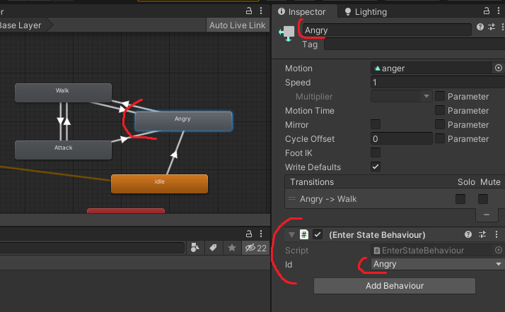

# Unity Animator State Machine

# Описание
**Внимание!** Эта реализация ТОЛЬКО под Unity и Animator.

Если вам не подошла реализация State Machine от самих Unity (через Animator и StateMachineBehaviour), то вы в нужном месте! Я сделал лучше, стабильнее и удобнее!

Я написал свою реализацию, потому что испробовав десяток разных State Machine, ни одна не подошла, везде были свои минусы.

Вы можете поддержать меня и мои проекты https://biba.dev/donation

Давайте обсуждать! Пишите как можно улучшить и про найденные ошибки.

**Ключевые особенности:**
* компактный, аккуратный и оптимизированный
* вам не обязательно ставить обратный вызов на каждую анимацию, вы можете просто проигрывать анимацию без логики
* вы можете поставить обратный вызов на анимацию, но НЕ ДОБАВЛЯТЬ РЕАЛИЗАЦИЮ и все будет работать
* связь анимации и реализации делается В САМОМ коде (например MobController)
* ЛЮБОЕ количество реализаций
* ВСЕ методы состояния (IState) содержат ссылку на контекст (например ICharacter)
* поддержка любого количества Animation Event (события устанавливаемые на файле анимации)

# Идея
Идея проста, у вас есть Animator Controller, который содержит анимации (состояния), при каждом заходе на анимацию (Enter State) срабатывает обратный вызов, который передает в State Machine НОВОЕ состояние, а State Machine устанавливает реализацию под это состояние.

Анимационные клипы и состояния из State Machine связываются через обратный вызов с передачей enum (id текущего состояния). 

# Описание
```
    public interface IState<in TContext> // именно через этот интерфейс идет реализация состояния
    {

        void Enter(TContext context); // когда вошли в состояние
        void LogicUpdate(TContext context); // обновление логики (MonoBehaviour.Update)
        void PhysicsUpdate(TContext context); // обновление физики (MonoBehaviour.FixedUpdate)
        void OnAnimationEvent(TContext context, int data); // обратный вызов из файла анимации (data = Animation Event Int)
        void Exit(TContext context); // выход из состояния

    }
    
    public class EmptyState<TContext> : IState<TContext> {} // пустое состояние, используется в State Machine когда нет явной реализации
```

Обратите внимание как везде участвует контекст, я рекомендую передавать контекстом ICharacter в вашем проекте, что бы из каждого состояния иметь доступ к персонажу.

```
    public interface IAnimatorChangeStateHandler // интерфейс для вашего MonoBehaviour контроллера, обратный вызов от аниматора к State Machine
    
```

```
    public abstract class EnterStateBehaviourBase<TEnum> : StateMachineBehaviour // базовый класс для установки поведения анимациям
```

```
    public class StateMachine<TEnum, TContext> // сама State Machine. TEnum - enum id состояния
    {
    
            public TEnum CurrentId => _currentId; // текущий Id состояния (из аниматора)
            public IState<TContext> CurrentState => _currentState; // текущая реализация состояния
            
            public void AddState(TEnum id, IState<TContext> state) // добавить состояние в State Machine
            public void LogicUpdate() // обновление логики (MonoBehaviour.Update)
            public void PhysicsUpdate() // обновление физики (MonoBehaviour.FixedUpdate)
            public void OnAnimationEvent(int data) // обратный вызов из файла анимации (MonoBehaviour, data = Animation Event Int)
            public void ChangeState(TEnum id) // сменить состояние (вызывается аниматором, можно вручную)
    }
```

# Установка

Скопируйте всю папку с скриптами в папку проекта Assets.

Создайте два файла: 

* **StateId.cs** (имя можно на свое усмотрение) в этом файле у вас будет enum с перечислением ВСЕХ состояний аниматора ДЛЯ ВСЕХ персонажей. Так же, этот enum будет в инспекторе Animator Controller и в IAnimatorChangeStateHandler.
Пример:
```
public enum StateId
{
    
    Idle = 0,
    Walk = 1,
    Run = 2,
    Attack = 3,
    Angry = 4
    
}
```
* **EnterStateBehaviour.cs** (наследуется от **EnterStateBehaviourBase**)
Этот класс необходим для установки поведения в Animator Controller с ссылкой на ваш enum (из пункта 1).
Пример:
```
public class EnterStateBehaviour : EnterStateBehaviourBase<StateId> {}
```

# Создание состояний
Используя интерфейс IState, мы создаем состояния, например:
```
public class AngryState : IState<ICharacter>
{

    private Vector3 _targetPosition;

    public void Enter(ICharacter context)
    {
        
        // какая то логика
        _targetPosition = Random.insideUnitSphere * context.CharacterSettings.ArealRadius;
        _targetPosition.y = 0;

    }

    public void LogicUpdate(ICharacter context)
    {
        
        // какая то логика
        var currentPosition = context.Transform.position;
        
        context.Transform.rotation = Quaternion.Lerp(context.Transform.rotation, 
            Quaternion.LookRotation(_targetPosition - currentPosition),
            context.CharacterSettings.RotateSpeed * Time.deltaTime); 
        
    }
    
    public void PhysicsUpdate(ICharacter context) {}

    public void OnAnimationEvent(ICharacter context, int data)
    {
        
        // какая то логика
        AudioPlayer.Play(context.Transform.position, 
            context.CharacterSettings.AngrySound, 1, Random.Range(.8f, 1f));
        
    }
    
    public void Exit(ICharacter context) {}
    
}
// для оптимизации, вы можете создавать static состояния (если у вас нет общих полей)
```
# Использование
В Animator Controller нужно выбрать анимации (состояния) которым вы хотите добавить логику (поведение) и установить им ваш класс **EnterStateBehaviour.cs** с передачей enum id состояния.


Допустим у вас есть контроллер моба
```
public class MobController : MonoBehaviour, ICharacter // интерфейс ICharacter будет нашим контекстом, вы сами его создаете под нужды своего проекта
{
    
    
    
}
```
Пример моего интерфейса ICharacter (вы должны сами создать в своем проекте)
```
public interface ICharacter
{
    
    Transform Transform { get; }
    Animator Animator { get; }
    Transform Target { get; }
    CharacterSettings CharacterSettings { get; }

}
```
Добавляем State Machine и вызываем ее обновление
```
public class MobController : MonoBehaviour, ICharacter
{
    
    private StateMachine<StateId, ICharacter> _stateMachine;

    private void Awake()
    {
        
        // напомню про EmptyState, изначально машина создается с пустым состоянием
        _stateMachine = new StateMachine<StateId, ICharacter>(this);
        
    }
    
    private void Update() => _stateMachine.LogicUpdate();
    private void FixedUpdate() => _stateMachine.PhysicsUpdate(); // НЕ обязательно, применяйте ТОЛЬКО если вам нужно обновлять физику у состояний
    
}
```

Далее добавляем интерфейс и создаем методы для обратных вызовов (один от самого аниматора, второй от событий анимации)
```
public class MobController : MonoBehaviour, ICharacter, IAnimatorChangeStateHandler<StateId>
{
    
    private StateMachine<StateId, ICharacter> _stateMachine;

    private void Awake()
    {
        
        _stateMachine = new StateMachine<StateId, ICharacter>(this);
        _stateMachine.AddState(StateId.Angry, new AngryState()); // связываем enum из аниматора с нашим состоянием
        
    }
    
    private void Update() => _stateMachine.LogicUpdate();
    public void OnAnimatorStateChanged(StateId id) => _stateMachine.ChangeState(id); // получаем обратный вызов от аниматора, передаем в State Machine
    public void OnAnimationEvent(int data) => _stateMachine.OnAnimationEvent(data); // (не обязательно, только если вы используйте события анимации), передаем в State Machine
    
}
```
Вот и все, так выглядит наш минимальный класс MobController.
Далее вы можете добавить любое количество состояний:
```
    private void Awake()
    {
        
        _stateMachine = new StateMachine<StateId, ICharacter>(this);
        _stateMachine.AddState(StateId.Walk, new WalkToRandomPointState());
        //_stateMachine.AddState(StateId.Walk, new WalkToBestPoint());
        _stateMachine.AddState(StateId.Attack, new AttackWithTimeLimitState(_projectile));
        _stateMachine.AddState(StateId.Angry, new AngryState());
        // _stateMachine.AddState(StateId.Angry, Random..... (behavior 1, behavior 2, behavior 3));
        
    }
```
Если вы хотите добавить события анимации, укажите название функции **OnAnimationEvent**, поле **int** будет вашими данными (**data**), у вашего состояния будет вызвано событие **public void OnAnimationEvent(int data)**

